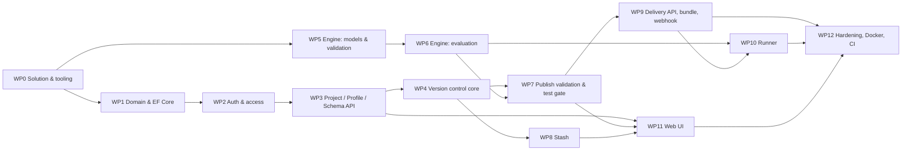

# Rooby — Implementation Plan

Companion to [SPEC.md](SPEC.md) (what to build) and [VERSION_CONTROL.md](VERSION_CONTROL.md)
(normative draft/publish/stash algorithm). This document says **in what order, in which project,
with which tests**. Section references (§) point at SPEC.md unless stated otherwise.

## 0. Current state

| Path | State |
|---|---|
| [src/Rooby.Api](src/Rooby.Api) | `dotnet new webapi` template (weather forecast), `net10.0`, OpenAPI only |
| [src/Rooby.Runner](src/Rooby.Runner) | Empty class library |
| [src/roobyweb](src/roobyweb) | Vite + React 19 + TS scaffold, no app code |
| Solution file | none |
| Database / migrations / tests / Docker | none |

## 1. Target layout

```
rooby/
  Rooby.slnx
  Directory.Build.props            # net10.0, nullable, implicit usings, analyzers, LangVersion
  Directory.Packages.props         # central package versions
  docker-compose.yml               # postgres (dev), rooby-api
  src/
    Rooby.Engine/                  # content models, validation, CEL binding, evaluation, bundle model (no DB)
    Rooby.Api/                     # EF Core, endpoints, auth, version control, publish, delivery, static SPA
    Rooby.Runner/                  # client: bundle sources, refresh, typed accessors (depends on Engine)
    roobyweb/                      # React SPA
  tests/
    Rooby.Engine.Tests/            # pure unit tests (xUnit)
    Rooby.Api.Tests/               # integration tests: WebApplicationFactory + Testcontainers PostgreSQL
    Rooby.Runner.Tests/
  docs/ (IDEA.md, REQUIREMENT.md, VERSION_CONTROL.md, SPEC.md, PLAN.md stay at root)
```

Dependency direction: `Rooby.Api → Rooby.Engine`, `Rooby.Runner → Rooby.Engine`. `Rooby.Engine`
references only `Celly` and `System.Text.Json`. Nothing references `Rooby.Api`.

## 2. Work packages



`WP5`/`WP6` (engine) can proceed in parallel with `WP1`–`WP4` (persistence) because the engine has
no database dependency.

---

### WP0 — Solution and tooling

**Deliverables**

- `Rooby.slnx` containing the three `src` projects and three `tests` projects.
- `Directory.Build.props`: `TargetFramework=net10.0`, `Nullable=enable`, `ImplicitUsings=enable`,
  `TreatWarningsAsErrors=true`, `EnableNETAnalyzers=true`.
- `Directory.Packages.props` with pinned versions: `Celly`, `Microsoft.EntityFrameworkCore`,
  `Npgsql.EntityFrameworkCore.PostgreSQL`, `Microsoft.AspNetCore.OpenApi`,
  `Microsoft.AspNetCore.Authentication.OpenIdConnect`, `xunit`, `Testcontainers.PostgreSql`,
  `Microsoft.AspNetCore.Mvc.Testing`, `Verify.Xunit` (snapshot tests for bundle/diff JSON).
- `docker-compose.yml`: `postgres:16` with a named volume; `.env.example`.
- Remove the weather‑forecast template from `Program.cs`; add `Rooby.Engine` project.
- `.editorconfig` (C# + TS), `.gitignore` for `bin/ obj/ node_modules/ dist/`.

**Done when** `dotnet build` and `dotnet test` (empty suites) pass; `docker compose up postgres` works.

---

### WP1 — Domain model and EF Core persistence (§2, §3)

**Deliverables** (`Rooby.Api/Data`)

- Entities exactly per §3: `Project`, `Profile`, `User`, `UserAccess`, `Version`, `Item`, `ItemLine`,
  `Schema`, `VersionSchema`, `TestCase`. Enums: `ItemType` (8 values incl. `Matrix`), `DataType`
  (6 values), `AccessLevel` `[Flags]`, `LoginProvider` `[Flags]`, `TestGate`.
- `UserLog` as an EF **owned type** → `<Name>At timestamptz`, `<Name>ByUserId int`.
- `Period` → `NpgsqlRange<DateOnly>` (`daterange`).
- `xmin` concurrency token on `Profile`, `Version`, `Item`, `ItemLine`, `TestCase`, `Schema`.
- `Content`/`Definition`/`InputData`/`OutputValue` as `jsonb` via `JsonDocument`.
- Composite PKs `(Id, VersionId)` on `Item`, `ItemLine`, `TestCase`; all indexes and constraints from
  §3.11, including the `EXCLUDE USING gist` on `schema(project_id, code, validity)` (needs
  `btree_gist`; add `HasPostgresExtension("btree_gist")`) and the partial unique index
  `item(profile_id, key) WHERE version_id = -1` (raw SQL in migration).
- Trigger or `SaveChangesInterceptor` that rejects `UPDATE` on `item/item_line/test_case` rows with
  `version_id > 0` (§7.2 immutability).
- `RoobyDbContext`, snake_case naming convention, initial migration, `--migrate` startup switch
  (§14).
- Seed: a `Local` bootstrap `SystemAdmin` user from configuration for dev.

**Tests** (`Rooby.Api.Tests`, Testcontainers)

- Migration applies on a clean database; model snapshot has no pending changes.
- Overlapping `Schema.Validity` for same `(ProjectId, Code)` → DB error.
- Updating a published `Item` row throws.
- `xmin` changes on update and is surfaced as `RowVersion`.

---

### WP2 — Authentication and access control (§3.3, §3.4, §11.1–11.2)

**Deliverables**

- OIDC authentication for `/api` (cookie session for SPA, bearer for tooling); `Local` provider for
  development (`dotnet user-secrets` credentials), disabled in production configuration.
- `ICurrentUser` resolving the claims principal to `User.Id` (auto‑provision as disabled unless
  `AutoProvision=true`).
- `IAccessService.GetEffectiveAccess(userId, projectId?, profileId?)` → bitwise OR of non‑revoked
  rows at the three scopes; cached per request.
- Endpoint filters / authorization policies: `RequireAccess(AccessLevel flag, scope)`.
- `UserAccess` endpoints: list, grant, `POST /access/{id}/revoke` (soft), `GET /users`, `GET /me`.

**Tests**

- Effective access composition across system/project/profile rows; revoked rows ignored.
- Profile user cannot read another profile; project user can read all profiles of the project.
- Revoke writes `IsRevoked` + `Revoked` and never deletes.

---

### WP3 — Project, Profile, Schema management (§3.1, §3.2, §3.8, §6, §10.1)

**Deliverables**

- CRUD endpoints for projects and profiles with identifier‑pattern validation, `TimeZone` validation
  (`TimeZoneInfo.TryFindSystemTimeZoneById`), `PublishUri` validation (`https` allow‑list or
  `file://` under export root), `PublishSecret` encrypted with Data Protection.
- API‑key generation/rotation: random 256‑bit, returned once, `ApiKeyHash` + `ApiKeyRotated` stored.
- Schema endpoints: create, `PUT` (atomic replace), list, get; `Definition` validated against the
  §6 subset (reject unsupported JSON‑Schema keywords).
- `ISchemaResolver.Current(projectId, code, dateInProfileZone)` used by WP4/WP7.
- RFC 9457 problem details, `ETag`/`If-Match` middleware (`409`/`412`).

**Tests**

- Invalid time zone / identifier / URI → `400` with problem details.
- Rotating the key invalidates the old one on the delivery endpoint (verified in WP9).
- Schema definition with unsupported keyword → `400`; valid definition round‑trips.

---

### WP4 — Version control core (VERSION_CONTROL §4–§5.7, §5.9; SPEC §7)

Implement exactly the pseudo‑code in VERSION_CONTROL.md, extended to three tables.

**Deliverables** (`Rooby.Api/Versioning`)

- `IVersionStore`:
  - `EnsureDraft`, `LatestPublishedId`, `Snapshot(profile, N)`, `WorkingSet(profile)`,
    `StashPreview(profile, stashId)` — `DISTINCT ON` queries from §7.1 for `item`, `item_line`,
    `test_case`; `VersionSchema` resolution.
  - `CreateItem`, `EditItem`, `DeleteItem`, `RestoreItem`; the same trio for lines and test cases;
    bulk `ReplaceLines(itemKey, lines[])` that diffs against the working set and writes minimal COW rows.
  - `ReorderLines` with gapped `SortOrder` (renumber only when a gap is exhausted).
  - `DiffDrafts` (§7.5) including `schemaUpdated` entries.
  - `Publish` (§7.2; VERSION_CONTROL §5.5) with profile row lock (`SELECT … FOR UPDATE`), re‑read of
    draft `xmin`, set‑based flips, `VersionSchema` capture (COW: only definitions that differ from the
    previous capture), post‑commit hook for WP9.
  - `DiscardDraft`.
- Key immutability after first publish; hard‑delete of never‑published rows (§7.3).
- Endpoints from §10.1 for items, lines, tests, diff, publish, discard, versions.

**Tests** — the mandatory list in VERSION_CONTROL §10 plus SPEC §9.3:

1. first publish → `VersionId = 1`; second → `2`
2. unchanged item: no new row; same `(Id, VersionId)` visible in v1 and v2
3. `Snapshot(1)` after v2 returns v1 content
4. delete then publish hides item in latest, keeps it in previous
5. concurrent publish: one success, one `409` (two parallel transactions in the test)
6. mid‑publish draft change → `409`
7. project schema change appears in profile vN only after that profile publishes
8. editing one lookup line writes one `item_line` row and zero `item` rows
9. deleting an item hides its lines in latest, shows them in latest‑1, no line tombstones
10. schema edited after v1 → `readSchema(profile, 1)` returns the v1 capture
11. never‑published item deleted → hard delete of item and its draft lines
12. key change on a published item → `400`
13. `ReplaceLines` with one changed row produces exactly one new line row

---

### WP5 — Engine: content models and validation (§4, §4.0, §4.8, §6, §8.1)

**Deliverables** (`Rooby.Engine`)

- `Content` model records per item type with `$v` versioning, `System.Text.Json` polymorphic
  (de)serialisation: `SingleValueContent`, `LookupContent`/`LookupLine`, `MatrixContent`/`MatrixRow`,
  `BasketContent`/`BasketLine`, `ExpressionRuleContent`, `DecisionTableContent`/`DecisionTableRow`,
  `DecisionTreeContent` (node union), `RuleListContent`/`RuleListStep`.
- `ValueSlot` union: `Literal | Expression | Ref(key, keys?) | InlineRule(itemType, content, lines?)`
  with a custom `JsonConverter` (§4.0).
- `RoobySchema` model (§6 subset) → CEL declarations builder (`Schema.Definition` → nested
  `VariableDecl`/map types for **checked** mode).
- `IContentValidator.Validate(item, lines, schema?, mode)` producing a problem list with paths
  (`line:<id>/cell:<col>`): shape rules of §4, slot type rules, matrix header/axis rules, decision
  table cell grammar parse, tree depth ≤ 32, inline nesting ≤ 8.
- `IDependencyExtractor.Extract(item, lines)` → set of referenced keys (walks slots, bindings,
  steps, inline rules, `ref.X` member accesses found by AST walk with Celly `AstTools`).
- `CelCompiler`: checked (`input` typed) and dynamic (`input: dyn`) environments; `tz`, `now`,
  `prev`, `vars`, `ref` declarations; `OptionalsLibrary`, `StringsLibrary`, `MathLibrary`;
  `EstimateCost` threshold; program cache keyed by expression text + mode.
- Decision‑table cell grammar compiler (§4.5) → CEL expression text.

**Tests** (`Rooby.Engine.Tests`, no DB)

- Round‑trip serialise/deserialise every content shape and every slot form.
- Validation fixtures: one passing and several failing JSON documents per item type (matrix:
  overlapping range headers, cell for unknown column, missing `SchemaId` with probes, wrong header
  shape).
- Dependency extraction finds refs in: bindings, steps, slots, inline rules three levels deep,
  `ref.X` inside expressions.
- Checked compile fails on unknown field / type mismatch; dynamic compile of the same text succeeds.
- Cost estimate rejects an unbounded comprehension.

---

### WP6 — Engine: evaluation (§5)

**Deliverables** (`Rooby.Engine`)

- `EvaluationContext { input, now, tz, vars (read‑only view), prev?, ItemResolver, Trace }`.
- `IItemEvaluator` per type:
  - `SingleValue`, `Basket` → constant.
  - `Lookup` exact (dictionary on stringified key tuple) and range (sorted by `from`, binary search
    on last key after exact match on the leading keys); validity filtering via `Profile.TimeZone`
    date of `now` (§5.6).
  - `Matrix`: axis matchers (exact dictionary / range binary search), row validity, probe evaluation
    when both probes present, explicit keys precedence, cell slot evaluation, `default`.
  - `ExpressionRule`: bindings → `vars`, then expression.
  - `DecisionTable`: all hit policies of §4.5; output slots; `Object` result for multi‑output.
  - `DecisionTree`: if/switch traversal; leaf slot.
  - `RuleList`: all five strategies; `when`, `enabled`, `priority`, validity; `bind` steps; nested
    `RuleList` gets its own `prev`.
- `ValueSlotEvaluator` (§4.0): literal / expression / ref (memoised per evaluation) / ref+keys
  (lookup or matrix probe) / inline rule (local `vars` scope).
- `RefMapResolver`: lazy `ref` map — `SingleValue`, `Basket`, exact `Lookup` nested map, exact×exact
  `Matrix` nested map, rules evaluated on demand; throws a publish‑time‑style error if `ref.X[…]` is
  used on a range item (also detected statically in WP7).
- Output coercion to `DataType` (§5.5); `RoobyEvaluationException` with item key + slot path (§5.4).
- `EvalLimits` per evaluation; cancellation token plumbed through.
- `EvaluationTrace` (which step/row/cell matched) for the UI test panel.
- `Bundle` model (§10.4) and `BundleEvaluator` = compiled, immutable, thread‑safe snapshot with a
  dependency‑ordered compile and cycle detection; shared by API (checked/dynamic) and Runner.

**Tests**

- Golden tests per item type from JSON fixtures (`input` → expected output).
- Matrix: range×exact, exact×exact via `ref[row][col]`, explicit keys vs probes, missing cell →
  default, sub‑rule cell, row validity switching at profile‑zone midnight (two `now` values one
  minute apart across `Asia/Hong_Kong` midnight).
- Sub rules: `vars` isolation (inner binding not visible outside), memoisation (a `ref` counted
  once per evaluation), depth limit.
- RuleList strategies: table‑driven tests including `Chain` pass‑through and `Priority` tie‑break.
- Decision table hit policies incl. `Unique` violation error.
- Cycle detection: `A → B → A` fails at bundle compile.
- Evaluation limit hit → `RoobyEvaluationException`.
- Appendix A scenario end‑to‑end from a fixture bundle: `FinalPriceBps` = expected value.

---

### WP7 — Publish validation, evaluate endpoint, test gate (§8, §10.1 evaluate/tests)

**Deliverables**

- Save‑time validation (§8.1) wired into WP4 create/edit endpoints using WP5 with **checked** mode
  and the schema selected by `Profile.TimeZone` date.
- Publish validation (§8.2): live key uniqueness, dangling refs, type compatibility, cycles, lookup
  and matrix uniqueness/overlap per validity, `ref.X[…]` on range items, referenced schemas exist.
- Test runner: execute all working‑set test cases against a `BundleEvaluator` built from the
  working set / a published snapshot / a stash preview; tolerance compare; `TestGate` behaviour.
- `POST /…/evaluate?view=…` (ad‑hoc input, returns value + trace) and `POST /…/tests/run?view=…`.
- Publish endpoint orchestrates: lock → validation → test gate → flip → capture → commit → hook.

**Tests**

- Publish with `TestGate=Block` and one failing test → `400`, no rows flipped.
- `Warn` mode publishes and returns failures.
- Dangling `ref` and cycle are reported with item keys; nothing flipped.
- Range lookup used as `ref.X[…]` → publish error.
- Evaluate endpoint on working set reflects an unsaved‑to‑published draft change; delivery does not.

---

### WP8 — Stash (VERSION_CONTROL §5.8; SPEC §7.4)

**Deliverables**

- `Stash`, `PopStash`, `ApplyStash`, `DropStash` over all three tables; `Profile.NextStashId`
  allocation under profile lock; stash `Version` rows; conflict list on apply; warning payload when
  `FromVersionId != latestPublished`.
- Endpoints from §10.1; stash preview via `view=stash&stash=<id>` on list/evaluate/tests.

**Tests**

- stash then publish other work: stash rows stay at `stashId`
- pop onto non‑empty draft → `409`
- apply with a conflicting draft item → `409` + conflict list; non‑conflicting apply leaves stash intact
- drop deletes stash version and rows; `NextStashId` never reused

---

### WP9 — Delivery API, bundle, webhook / file export (§10.2–10.4, §11.3, §11.5)

**Deliverables**

- `X-Api-Key` authentication handler (SHA‑256 compare, constant‑time) scoped to one profile.
- `BundleBuilder(snapshot)` → §10.4 document (no schemas; `?includeTests=true` optional);
  `ETag` = hash of bundle; `Cache-Control: immutable` for explicit `n`.
- Endpoints: `versions/latest`, `bundle`, `items/{key}`, `evaluate/{key}` (dynamic mode, `422` on
  evaluation error).
- Post‑publish dispatcher (background queue, retry with backoff, outcome logged and surfaced on the
  version row): `https` webhook with `X-Rooby-Signature` HMAC + `X-Rooby-Version`; `file://` export
  writing `-v<N>.json` and `-latest.json` atomically (write temp + rename).
- SSRF guard: host allow‑list from configuration; export root confinement.

**Tests**

- Wrong/rotated key → `401`; key of profile A cannot read profile B.
- Bundle for `n` is byte‑identical across calls and after later publishes (snapshot test).
- Draft/stash rows never appear in delivery responses.
- Webhook receives signed payload (test server verifies HMAC); failure does not roll back publish.
- File export produces both files; `latest` is replaced atomically.

---

### WP10 — Runner (§12)

**Deliverables** (`Rooby.Runner`)

- `RoobySource.Http(baseUri, apiKey)`, `.File(path)`, `.Bundle(json)`.
- `RoobyRunner.LoadAsync(source, RoobyVersion.Latest | .Pinned(n))`; `RefreshAsync` (polls
  `versions/latest`, hot‑swaps `BundleEvaluator` via `Interlocked.Exchange`); `VersionId`.
- Typed accessors: `GetValue<T>`, `Lookup<T>(key, params object[] keys)`,
  `Matrix<T>(key, row, col)`, `Basket(key)`, `Evaluate<T>(key, input, now?)`, `RunTests()`.
- Input adapter: accepts `JsonElement`, `IDictionary<string, object?>`, or POCO (serialised via
  `System.Text.Json` to the dictionary shape CEL expects). No schema validation (§6).
- Dynamic compile mode only; bundle shape validation on load.

**Tests**

- Load from file/bundle string; pinned vs latest; refresh swaps only when `versionId` changes.
- Concurrency: evaluations in flight complete on the old snapshot during a refresh.
- Typed accessor coercions (`double`, `decimal`, `int`, `string`, `bool`, `List<T>`, `Dictionary` for `Object`).
- Appendix A fixture: same answers as WP6 golden test.

---

### WP11 — Web UI (§13)

Phased so each phase is usable on its own.

**Phase A — shell and read‑only**

- Routing, OIDC login (BFF cookie), project/profile switcher filtered by access, item list with change
  badges, version history, read‑only item viewers, bundle download.
- API client generated from the OpenAPI document; `ETag` handling.

**Phase B — editing**

- Editors: `SingleValue` form, `Lookup`/`Basket` virtualised grid with spreadsheet paste,
  `DecisionTable` grid with cell grammar hints, `DecisionTree` tree editor, `RuleList` step builder
  (drag reorder, `ref` picker, inline rule, `bind`), **Matrix grid** (axis config, column header
  editor, range header editor, row add/reorder, per‑cell literal/expression/sub‑rule popover).
- CEL editor (CodeMirror 6) with schema‑driven autocomplete and server‑side check on blur.
- Test panel: ad‑hoc input JSON editor, saved test cases, run, trace viewer.
- `409` handling: show server copy, allow reapply.

**Phase C — release workflow**

- Pending changes / diff view, publish dialog (description, test gate results), discard.
- Stash list, pop/apply/drop, preview mode banner.
- Schema editor (project scope), access management screen, profile settings (time zone, publish
  target, API key rotation).

**Tests**

- Vitest unit tests for the value‑slot editor and matrix grid model (header/cell reconciliation).
- Playwright smoke: login (local provider) → create item → save → publish → bundle contains it.

---

### WP12 — Hardening, packaging, CI

- Rate limits on delivery `evaluate`; request size caps; JSON depth limits.
- OpenTelemetry traces/metrics; structured logging for discard/drop/publish‑failure/webhook outcome
  (§11.6).
- `Dockerfile` for `rooby-api` (multi‑stage: `npm install` + `vite build` → copied to `wwwroot`;
  `dotnet publish`), `docker-compose.yml` with `postgres` + `rooby-api`; healthchecks.
- GitHub Actions: build, `dotnet test` (Testcontainers), `npm run build`, `npm test`, image build.
- Load test of `snapshot(N)` with 100 versions × 20 000 lines to confirm `DISTINCT ON` performance;
  add the materialised `VersionItem` cache only if this fails (§9.1).

---

## 3. Cross‑cutting conventions

- **IDs**: `Guid.CreateVersion7()` for all `Uuid` columns.
- **Time**: store `timestamptz`; `now` is `DateTimeOffset`; date conversions via `TimeZoneInfo`
  with the profile zone; never `DateTime.Now`.
- **JSON**: `System.Text.Json`, camelCase, `JsonDocument`/`JsonElement` at the boundary; typed
  records inside the engine.
- **Errors**: RFC 9457 problem details everywhere; validation problems carry `path` and `code`.
- **Transactions**: every mutating version‑control operation is one `IDbContextTransaction` with
  `SELECT … FOR UPDATE` on the profile row first.
- **Tests**: xUnit; integration tests share one PostgreSQL container per test class, one schema per
  test for isolation.
- **No schema at runtime**: anything under `Rooby.Runner` must compile without referencing
  `RoobySchema`.

## 4. Milestones

| Milestone | Includes | Demonstrates |
|---|---|---|
| M1 Persist & version | WP0–WP4 | Create/edit/publish items via API; `snapshot(N)` correct under all VERSION_CONTROL tests |
| M2 Evaluate | WP5–WP7 | Publish gated by validation + tests; evaluate any item type incl. Matrix and sub rules |
| M3 Deliver | WP8–WP10 | Runner in a sample console app prices Appendix A from a live profile; stash workflow |
| M4 Operate | WP11–WP12 | Business users maintain a matrix in the UI and publish; Docker image in CI |

## 5. Risks and mitigations

| Risk | Mitigation |
|---|---|
| Celly API surface differs from assumptions (declarations for nested maps, `AstTools` for ref extraction) | Spike in WP5 first task: build the checked environment from a sample schema and walk an AST; adjust `CelCompiler` design before other WP5 work. |
| `DISTINCT ON` snapshot too slow for large profiles | Indexes from §3.11 first; benchmark in WP12; `VersionItem` cache is an additive fallback. |
| Matrix column changes touching many rows | Column add/remove only rewrites rows that gain/lose a value; rename is a header‑key change plus per‑row cell key rename computed server‑side in `ReplaceLines`. |
| Sub‑rule cycles or runaway inline nesting | Static cycle check at publish + depth limit at save; `EvalLimits` at runtime as last line of defence. |
| Time‑zone edge cases (DST, invalid IANA on Windows) | Use IANA ids; `TimeZoneInfo` with ICU on all platforms; tests around midnight and DST transitions. |
| Webhook endpoint down at publish | Publish commits regardless; dispatcher retries; version row shows delivery status. |
