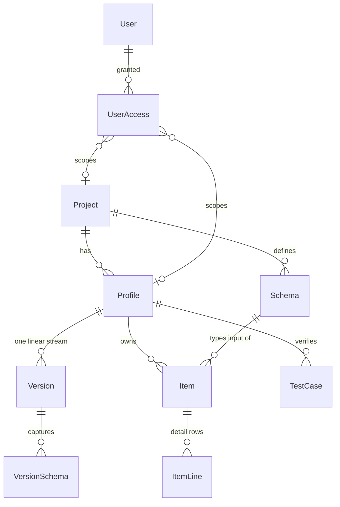

# Rooby — System Specification

Rooby is a generic, version-controlled business rule and configuration management system with a
web editor, a delivery API and a client runner. Applications embed the runner (or call the API) to
evaluate rule sets, query lookups and read configuration at any **published** version.

The first tenant is a **structured product pricing rule engine** used by sales and trading desks in
several regions; the system itself stays domain-agnostic. The pricing use case is only an
illustration in [Appendix A](#appendix-a--worked-example-structured-product-pricing).

## Document precedence

| Document | Role |
|---|---|
| [IDEA.md](IDEA.md) | **Authority for data schemas** (tables, columns, types). |
| [REQUIREMENT.md](REQUIREMENT.md) | Objectives, feature list, technology choices. |
| [VERSION_CONTROL.md](VERSION_CONTROL.md) | Draft / publish / stash algorithm. Field names there are mapped to IDEA names in [§9.1](#91-name-reconciliation). Its references to `SCHEMA.md` should be read as *this document*. |
| This SPEC | Consolidates the above; resolves conflicts; proposes improvements. |

Legend used in the data model below:

- **(+)** column/table/rule proposed in addition to IDEA
- **(~)** proposed change to something IDEA already defines
- unmarked = as in IDEA

---

## 1. Concepts



| Concept | Meaning |
|---|---|
| **Project** | A bounded domain inside the company (e.g. *Structured Products*). Owns the **schemas** (input data definitions). |
| **Profile** | An independently managed, independently published set of items inside a project (e.g. *APAC‑Sales*, *EMEA‑Trading*). Permissions, versions, publish targets are per profile. |
| **Item** | A logical configuration or rule identified by a stable `Key`. Eight kinds (`ItemType`). Header/definition lives in `Item.Content`; repeating detail lives in `ItemLine`. |
| **ItemLine** | A row of an item: lookup entry, basket member, decision‑table row, rule‑list step. Versioned independently of its parent (line-level copy-on-write). |
| **Schema** | Project-level JSON definition of an input document. Used **only at save and publish time** (web UI and management API) to type‑check CEL, drive editor forms and validate test‑case input. Prepared by developers; not consulted by the runner. |
| **Version** | One linear, per‑profile stream. `VersionId > 0` published, `-1` the single draft, `≤ -2` stashes. |
| **TestCase** | Input document + expected output for an item key; run in the editor and as a publish gate. |
| **Runner** | Client library (`Rooby.Runner`) that loads a published bundle and evaluates items offline. |

---

## 2. Common types

| Type | PostgreSQL / EF Core mapping | Notes |
|---|---|---|
| `Uuid` | `uuid` | Generated by the app (`Guid.CreateVersion7()`) so rows sort by creation. |
| `UserLog` | owned type → two columns `<Name>At timestamptz`, `<Name>ByUserId int` | `Created` is required; `LastModified`, `Deleted`, `Published` are nullable. **(~)** `By` is `User.Id` (`int`), not a `Guid` as written in VERSION_CONTROL. |
| `Period` | `daterange` (`NpgsqlRange<DateOnly>`) | Lower bound inclusive, upper exclusive; unbounded upper allowed. |
| `Flags` | `int` with a `[Flags]` enum | See §3.3 / §3.4. |
| `JSON` | `jsonb` | Row body ≤ 1 MB (app-enforced). |
| `RowVersion` **(+)** | PostgreSQL `xmin` mapped with `UseXminAsConcurrencyToken()` | On `Profile`, `Version`, `Item`, `ItemLine`, `TestCase`, `Schema`. Surfaced to clients as an `ETag`. |

Identifiers used in URLs and CEL (`Project.Code`, `Profile.Code`, `Item.Key`, `Schema.Code`) must match
`^[A-Za-z][A-Za-z0-9_]*$`. This keeps `ref.<Key>` a valid CEL member access and keys URL-safe.

---

## 3. Data model

### 3.1 Project

| Column | Type | Notes |
|---|---|---|
| Id | Uuid | PK |
| Code | Varchar(20) | Unique. Identifier pattern above. |
| Name | Nvarchar(100) | |
| IsDisabled | Boolean | Disabled projects are read-only and hidden from pickers. |
| Created | UserLog | |
| LastModified | UserLog? | |
| Remark | Nvarchar(4000) | |

### 3.2 Profile

| Column | Type | Notes |
|---|---|---|
| Id | Uuid | PK |
| **ProjectId (+)** | Uuid | FK → Project. Missing in IDEA but required by "a project can have multiple profiles". Unique `(ProjectId, Code)`. |
| Code | Varchar(20) | |
| Name | Nvarchar(100) | |
| **TimeZone (+)** | Varchar(64) | IANA time zone id (e.g. `Asia/Hong_Kong`). All date checks for this profile — `ItemLine.Validity`, `Schema.Validity` selection, and the `tz` CEL variable — use this zone (§5.6). Validated against `TimeZoneInfo.TryFindSystemTimeZoneById`. Default `UTC`. |
| PublishUri | Nvarchar(500)? | Post-publish target. `https://…` → webhook POST of the bundle (§10.4); `file://…` → bundle written to path. Null → none. |
| **PublishSecret (+)** | Nvarchar(200)? | HMAC secret for the webhook signature header; stored encrypted (Data Protection API). |
| **ApiKeyHash (+)** | Varchar(128)? | SHA‑256 of the delivery API key for this profile (§11.3). |
| **ApiKeyRotated (+)** | UserLog? | Who last rotated the delivery key and when. |
| **NextStashId (+)** | int | Starts at `-2`, decremented on every stash, never reused (VERSION_CONTROL §2). |
| **TestGate (+)** | Enum (`None`, `Warn`, `Block`) | Whether failing test cases block publish (§8.3). Default `Block`. |
| IsDisabled | Boolean | |
| Created | UserLog | |
| LastModified | UserLog? | |
| Remark | Nvarchar(4000) | |

### 3.3 User

| Column | Type | Notes |
|---|---|---|
| Id | int | PK, identity |
| LoginName | Varchar(20) **(~ → 100)** | UPNs / e‑mails from OIDC/SAML rarely fit in 20 chars. Unique (case-insensitive). |
| LoginProvider | Flags | `Local=1, ActiveDirectory=2, Saml=4, Oidc=8`. Flags so one identity may be linked to several providers. |
| DisplayName | Nvarchar(250) | |
| IsDisabled | Boolean | |
| Created | UserLog | |
| LastModified | UserLog? | |

Authentication is delegated to the enterprise IdP; Rooby stores only the identity link. A `Local`
provider exists for bootstrap/dev.

### 3.4 UserAccess

| Column | Type | Notes |
|---|---|---|
| Id | int | PK |
| UserId | int | FK → User |
| ProjectId | Uuid? | |
| ProfileId | Uuid? | |
| AccessLevel | Flags | see below |
| **IsRevoked (+)** | Boolean | Grants are never hard‑deleted; revoke sets this flag so access history stays queryable. |
| Created | UserLog | |
| LastModified | UserLog? | |
| **Revoked (+)** | UserLog? | Set when `IsRevoked` is true. |

Only rows with `IsRevoked = false` contribute to effective access. Changing a grant's `AccessLevel` is
modelled as revoke + new row, so each row is an immutable record of one grant.

Scope rules **(+)** (DB check constraint):

| ProjectId | ProfileId | Scope |
|---|---|---|
| null | null | System-wide (only `SystemAdmin` meaningful here) |
| set | null | Every profile of the project + project-level objects (schemas) |
| set | set | One profile (`Profile.ProjectId` must equal `ProjectId`) |

`AccessLevel` flags:

| Flag | Value | Grants |
|---|---|---|
| `Read` | 1 | View items, versions, diffs, tests; read delivery API through the UI |
| `Edit` | 2 | Create/edit/delete draft items, lines, test cases; stash/pop/apply/discard |
| `Publish` | 4 | Publish the profile draft |
| `ManageProfile` | 8 | Edit profile settings, publish targets, API key, profile-scoped access |
| `ManageSchema` | 16 | Create/edit project schemas (project scope) |
| `ManageProject` | 32 | Create/disable profiles, project-scoped access |
| `SystemAdmin` | 64 | Everything, create projects, manage users |

Effective access = bitwise OR of all rows matching the user at `(null,null)`, `(project,null)`,
`(project,profile)`. Rule permission is profile level, as required.

### 3.5 Version

| Column | Type | Notes |
|---|---|---|
| Id | int | PK (surrogate; never changes when a draft is published) |
| ProjectId | Uuid | Denormalised from Profile; check `= Profile.ProjectId`. |
| ProfileId | Uuid | FK → Profile |
| VersionId | int | Public number. `> 0` published, `-1` draft, `≤ -2` stash. Unique `(ProfileId, VersionId)`. |
| FromVersionId | int | Base of this overlay: `0` or a published `VersionId` of the same profile. Never `-1`, never a stash. |
| Description | Nvarchar(100) | Publish notes or stash label. |
| Created | UserLog | |
| Published | UserLog? | Set iff `VersionId > 0`. |

### 3.6 Item

`Item` rows are **revisions**. `Id` is the stable logical identity across versions; one row exists per
`(Id, VersionId)` in which the item changed.

| Column | Type | Notes |
|---|---|---|
| Id | Uuid | Logical item id (stable). |
| ProfileId | Uuid | FK → Profile |
| Key | Varchar(30) | Identifier pattern. Unique among *live* items of the working set (app-enforced; see indexes). **(+)** Immutable once any revision of the item is published — delivery clients bind to keys. |
| VersionId | int | FK → `Version(ProfileId, VersionId)`. |
| ItemType | Enum | `SingleValue, Lookup, RuleList, DecisionTree, DecisionTable, ExpressionRule, Basket` **(+ `Matrix`)** (§4). Immutable for the life of the item. |
| DataType | Enum | Output type: `Boolean, Number, String, List` **(+ `Date`, `Object`)**. `Date` covers schedule inputs/outputs; `Object` lets a rule set return a structured result (e.g. price + breakdown). |
| IsDeleted | Boolean | Tombstone for this overlay row. |
| SchemaId | Uuid **(~ nullable)** | Input schema the rule is type-checked against. `SingleValue`, `Lookup`, `Basket` have no input document and leave it null. |
| Description | Nvarchar(100) | |
| Content | JSON | Full header document for this revision (never a patch). Shape per §4. |
| Created | UserLog | When this revision row was written. |
| LastModified | UserLog? | Only ever set on the draft row (`VersionId = -1`). |
| Deleted | UserLog? | Set when `IsDeleted` is true. |

Physical key **(+)**: `PRIMARY KEY (Id, VersionId)`.

### 3.7 ItemLine

Detail rows, versioned with the same copy-on-write rule as `Item`: editing one row of a 10 000‑row
lookup writes exactly one `ItemLine` revision and no `Item` revision.

| Column | Type | Notes |
|---|---|---|
| Id | Uuid | Logical line id (stable). |
| ProfileId | Uuid | |
| ItemId | Uuid | Logical `Item.Id` (not a FK to a revision row). |
| VersionId | int | FK → `Version(ProfileId, VersionId)` |
| SortOrder | int | Evaluation/display order. **(+)** Allocate with gaps (`1000, 2000, …`) so inserts/reorders rewrite few rows. |
| IsDeleted | Boolean | Tombstone |
| SchemaId | Uuid? | Line‑specific input schema (e.g. an ad‑hoc sub‑rule with a narrower input). |
| InheritSchema | Boolean | `true` → use parent `Item.SchemaId`; `SchemaId` must then be null. |
| **Validity (+)** | Period? | Effective period of the line. Null = always. Enables schedule‑based rules/lookups declaratively (§5.6) instead of hand-written `now` guards. |
| Remarks | Nvarchar(500) | |
| Content | JSON | Line body for this revision. Shape per §4. |
| Created | UserLog | |
| LastModified | UserLog? | |
| Deleted | UserLog? | |

Physical key **(+)**: `PRIMARY KEY (Id, VersionId)`.

A line is visible in a snapshot only if its own latest row is not deleted **and** its parent item
is visible in the same snapshot. Deleting an item therefore hides its lines without writing line
tombstones; restoring the item brings them back.

### 3.8 Schema

Project-level definition of an input document.

| Column | Type | Notes |
|---|---|---|
| Id | Uuid | PK |
| ProjectId | Uuid | FK → Project |
| **Code (+)** | Varchar(30) | Logical schema name shared by successive time-bounded definitions (VERSION_CONTROL §5.2 "same ID … no overlapping duration" needs a shared identifier that is not the PK). |
| Name | Nvarchar(100) | |
| Validity | Period | Definitions with the same `(ProjectId, Code)` must not overlap (exclusion constraint on `daterange`). |
| Definition | JSON | Rooby schema document (§6). |
| Created | UserLog | |
| LastModified | UserLog? | |

Schemas are **not** part of the profile version stream (they have no draft/stash). They are
prepared by developers, edited in place at project level (a `PUT` replaces the whole definition
atomically, so a production update is one call) and **captured** into each profile version at publish
(§9.2). Semantics of `Validity`: it says which definition is *current* for a `Code` on a given date; the
editor binds an item to the definition that is current when the item is saved; the published
version is frozen to whatever it was validated against.

Schemas are a **design‑time** artefact: they gate what may be saved and published, and they let the
UI render forms and autocomplete. Once a version is published the runner never reads them (§5.1,
§12).

### 3.9 VersionSchema (+)

Materialises VERSION_CONTROL §5.5 ("capture project-level items at publish") — IDEA has no place to
hold a captured schema because `Item.ItemType` has no `Schema` member.

| Column | Type | Notes |
|---|---|---|
| ProfileId | Uuid | |
| VersionId | int | Published version (`> 0`) |
| SchemaId | Uuid | |
| Definition | JSON | Copy of `Schema.Definition` at publish time |
| Validity | Period | Copy |

PK `(ProfileId, VersionId, SchemaId)`. A row is written at publish for every schema referenced by a
live item or line in `snapshot(N)` **whose definition differs** from the row captured at the previous
version (copy-on-write, same spirit as items). `readSchema(profile, N, schemaId)` = latest
`VersionSchema` row with `VersionId ≤ N`.

The capture serves the management side only: history/diff of what a published version was validated
against, and the editor test panel when re‑running tests on an old version. It is not delivered to
the runner.

### 3.10 TestCase

| Column | Type | Notes |
|---|---|---|
| Id | Uuid | Logical id |
| ProfileId | Uuid | |
| VersionId | int | Same COW stream as items: `-1` draft, `> 0` published, `≤ -2` stash. |
| ItemKey | Varchar(30) | Target item by key (resolves in the same snapshot). |
| InputData | JSON | `{ "input": <document>, "now": "<timestamp>?", "options": { "tolerance": 1e-9 }? }` |
| OutputValue | JSON | Expected output, compared by deep JSON equality (numbers within tolerance). |
| **IsDeleted (+)** | Boolean | Needed for COW tombstones. |
| Remarks | Nvarchar(4000) | |
| Created | UserLog | |
| LastModified | UserLog? | |
| **Deleted (+)** | UserLog? | |

Physical key **(+)**: `PRIMARY KEY (Id, VersionId)`.

Test cases are versioned alongside the rules they test, because a rule change usually changes the
expected output; publishing flips them with the items (§8.3).

### 3.11 Indexes & constraints

```
project        UNIQUE (code)
profile        UNIQUE (project_id, code)
user           UNIQUE (lower(login_name))
user_access    CHECK  (project_id IS NOT NULL OR profile_id IS NULL)
version        UNIQUE (profile_id, version_id)
               CHECK  (version_id <> 0 AND from_version_id >= 0)
item           PK (id, version_id)
               INDEX (profile_id, version_id)
               INDEX (profile_id, key, version_id)
               UNIQUE (profile_id, key) WHERE version_id = -1        -- one draft row per key
item_line      PK (id, version_id)
               INDEX (profile_id, item_id, version_id)
               INDEX (profile_id, version_id)
schema         EXCLUDE USING gist (project_id WITH =, code WITH =, validity WITH &&)
version_schema PK (profile_id, version_id, schema_id)
test_case      PK (id, version_id)
               INDEX (profile_id, version_id)
               INDEX (profile_id, item_key)
```

Live-key uniqueness across published + draft overlay cannot be a plain DB constraint; it is checked
in `createItem` under the profile lock and again in publish validation (§8.2).

---

## 4. Item types and content shapes

`Item.Content` is the header; `ItemLine.Content` is one detail row. All JSON property names are
camelCase. `"$v": 1` in every `Content` allows future shape migrations.

| ItemType | Uses lines | Input schema | Purpose |
|---|---|---|---|
| `SingleValue` | no | no | One typed configuration value. |
| `Lookup` | yes | no | Keyed table (1..n key columns → value). Composite key covers n‑dimensional tables. |
| `Matrix` **(+)** | yes | optional | Two‑dimensional grid: row axis × column axis → cell. Each axis is exact or range matched; cells may be literals **or sub rules**. |
| `Basket` | yes | no | Named list of values for `in` tests (e.g. restricted underlyings). |
| `ExpressionRule` | no | yes | One CEL expression → value. |
| `DecisionTable` | yes | yes | Columns × rows with a hit policy. |
| `DecisionTree` | no | yes | Nested if/else or switch nodes. |
| `RuleList` | yes | yes | **Rule set**: ordered steps (references or ad‑hoc rules) with an execution strategy. Covers *composite*, *connected sub rules*, *schedule* (via line `Validity`). |

### 4.0 Value slots and sub rules

Wherever an item type produces a value from a fixed position — a `Matrix` cell, a `DecisionTable`
output cell, a `DecisionTree` leaf, a `RuleList` step — that position is a **value slot**. A slot
accepts one of:

| Form | Meaning |
|---|---|
| JSON literal | Constant of the slot's declared type. |
| `{ "expression": "<CEL>" }` | Evaluated in the current context (§5.2). |
| `{ "ref": "<Key>" }` | **Sub rule**: the referenced item is evaluated with the same `input`, `now`, `tz`, `vars`; its result is the slot value. Memoised per evaluation. |
| `{ "ref": "<Key>", "keys": ["<CEL>", …] }` | Probe a `Lookup` / `Matrix` with explicit key expressions (works for exact and range axes). |
| `{ "rule": { "itemType": …, "content": { … }, "lines": [ … ]? } }` | **Inline ad hoc sub rule**. Allowed types: `ExpressionRule`, `DecisionTree`, `DecisionTable`, `Matrix` (their lines are embedded in `lines`). `RuleList`, `Lookup`, `Basket`, `SingleValue` must be referenced by key instead. |

Rules:

- A slot's result is coerced to the slot's declared type (§5.5); mismatch is an evaluation error.
- Sub rules see `vars` as a read‑only snapshot; `bindings` declared inside a sub rule are local to it.
  `prev` is available only to `RuleList` `Chain` steps.
- Inline nesting depth ≤ 8. Every `ref` (including those inside inline rules) is part of the dependency
  graph (§5.3); cycles are a publish error.
- Evaluation traces and errors identify a slot by path, e.g. `FinalPriceBps/line:3/cell:1Y`.

### 4.1 SingleValue

```jsonc
// Item.Content
{ "$v": 1, "value": 5000000, "unit": "USD",
  "editor": { "input": "number", "min": 0, "step": 1000 } }   // UI hint only
```

`value` must conform to `DataType`. `List` values carry `"elementType"`.

### 4.2 Lookup

```jsonc
// Item.Content
{ "$v": 1,
  "keys":   [ { "name": "productType", "type": "String" },
              { "name": "tenor",       "type": "String" } ],
  "match":  "exact",              // exact | range (range: last key column is [from,to) on a Number/Date)
  "value":  { "type": "Number" }, // or { "type": "Object", "fields": [...] }
  "default": null }

// ItemLine.Content
{ "$v": 1, "key": { "productType": "ELN", "tenor": "1Y" }, "value": 35 }
// range match example: { "key": { "tier": "Gold", "from": 1000000, "to": 5000000 }, "value": 0.9 }
```

Duplicate keys within the live line set are a publish error. Lines with `Validity` shadow each other
by date (§5.6).

### 4.3 Basket

```jsonc
// Item.Content
{ "$v": 1, "elementType": "String", "unique": true }
// ItemLine.Content
{ "$v": 1, "value": "TSLA.US" }
```

Exposed to CEL as a list: `input.product.underlying in ref.RestrictedUnderlyings`.

### 4.4 ExpressionRule

```jsonc
{ "$v": 1,
  "bindings": [                                   // resolved by the engine before CEL runs
    { "name": "spread", "lookup": "TenorSpreadBps",
      "keys": ["input.product.type", "input.product.tenor"] }
  ],
  "expression": "vars.spread + (input.client.tier == 'Gold' ? -5 : 0)",
  "default": null }                               // returned when expression yields null/error-with-default
```

### 4.5 DecisionTable

```jsonc
// Item.Content
{ "$v": 1,
  "hitPolicy": "First",     // First | Unique | Priority | Any | Collect | CollectSum | CollectMin | CollectMax | CollectCount
  "columns": [
    { "name": "tier",     "kind": "condition", "expression": "input.client.tier" },
    { "name": "notional", "kind": "condition", "expression": "input.trade.notional" },
    { "name": "markup",   "kind": "output",    "type": "Number" }
  ],
  "default": 0 }

// ItemLine.Content  (SortOrder = row order; "priority" optional for Priority policy)
{ "$v": 1, "cells": { "tier": "'Gold'", "notional": ">= 1000000" },
  "output": { "markup": 10 }, "priority": 0 }
```

Cell grammar: empty / `-` = any; a value → equality; leading comparison operator (`<, <=, >, >=, !=`)
→ relational; `in [...]` / `in ref.X`; interval `[a, b)`; otherwise a full CEL boolean using `$` as
the column value. Each cell compiles to CEL once at load.

Output cells are value slots (§4.0), so a row may return a constant, an expression or a sub rule.
Multiple output columns → `DataType = Object`; a single output column → its type.

### 4.6 DecisionTree

```jsonc
{ "$v": 1,
  "root": { "if": "input.product.type == 'ELN'",
            "then": { "switch": "input.client.region",
                      "cases": { "'APAC'": { "result": 30 }, "'EMEA'": { "result": 28 } },
                      "default": { "result": 35 } },
            "else": { "result": "ref.DefaultSpreadBps" } } }
```

Leaf `result` is a value slot (§4.0): literal, `{ "expression" }`, `{ "ref" }` or inline `{ "rule" }`.
Depth ≤ 32.

### 4.7 RuleList (rule set)

```jsonc
// Item.Content
{ "$v": 1,
  "strategy": "Chain",          // FirstMatch | All | Chain | Aggregate | Priority
  "aggregate": null,            // for Aggregate: Sum | Min | Max | Count | Product
  "seed": 0,                    // Chain: initial `prev`
  "output": { "type": "Number" } }

// ItemLine.Content — reusable reference
{ "$v": 1, "ref": "ClientTierMarkup", "when": "input.client.tier != ''", "priority": 10, "enabled": true }

// ItemLine.Content — ad hoc inline rule (any single-item type except RuleList)
{ "$v": 1, "when": "prev > 100",
  "rule": { "itemType": "ExpressionRule",
            "content": { "$v": 1, "expression": "prev * 0.9" } } }

// ItemLine.Content — bind a variable for later steps (no output)
{ "$v": 1, "bind": "spread", "lookup": "TenorSpreadBps",
  "keys": ["input.product.type", "input.product.tenor"] }
```

Strategies:

| Strategy | Semantics | Output |
|---|---|---|
| `FirstMatch` | Steps in `SortOrder`; first enabled, in‑validity step whose `when` is true and result non‑null wins. | step result |
| `All` | Every matching step's non‑null result. | `List` |
| `Chain` | `prev` starts at `seed`; each matching step receives `prev` and its result becomes the next `prev`. Non‑matching steps pass `prev` through. | final `prev` |
| `Aggregate` | Collect as `All`, then fold with `aggregate`. | scalar |
| `Priority` | Evaluate all matching steps; highest `priority` non‑null result wins (ties → lower `SortOrder`). | step result |

A step whose `ref` targets another `RuleList` is a connected sub‑rule; it is evaluated with the same
`input`, `now` and `vars` and its own `prev` (its `seed`). Step `ref` / `rule` follow the value‑slot
forms in §4.0.

### 4.8 Matrix (+)

A two‑dimensional grid. Column headers live in `Item.Content`; each `ItemLine` is one **row**
(row header + its cells), so editing a row or adding a row is one COW line, while adding a column is
one `Item` revision plus the rows that receive a value for it.

```jsonc
// Item.Content
{ "$v": 1,
  "rows": { "name": "notional", "type": "Number", "match": "range",
            "probe": "input.trade.notional" },                 // probe is optional (see below)
  "cols": { "name": "tenor",    "type": "String", "match": "exact",
            "probe": "input.product.tenor",
            "headers": [ { "key": "1Y" }, { "key": "2Y" }, { "key": "3Y" } ] },
  "cell":    { "type": "Number" },
  "default": null }

// ItemLine.Content — one line per row; SortOrder = display order
{ "$v": 1,
  "header": { "from": 0, "to": 1000000 },          // exact axis: { "key": "Gold" }
  "cells":  { "1Y": 30,
              "2Y": { "ref": "SmallTicket2Y" },                       // sub rule
              "3Y": { "expression": "vars.base + 5" } } }             // missing cell → default
```

| Element | Rules |
|---|---|
| Axis `match` | `exact` → header `{ "key" }`, compared after stringification. `range` → header `{ "from", "to" }` on `Number`/`Date`, interval `[from, to)`, `null` bound = unbounded. Headers on one axis must be unique / non‑overlapping (publish error). |
| Axis `probe` | Optional CEL expression that produces the axis key from `input`. When **both** axes have a probe, the matrix is directly evaluable as a rule (`runner.Evaluate("Key", input)`, `ref.Key` inside expressions, `RuleList` step) and `Item.SchemaId` is required. Without probes it is a data item addressed with explicit keys (below). |
| Explicit keys | `{ "ref": "Key", "keys": [rowExpr, colExpr] }` in a slot, `bindings` / `bind` with two `keys`, or `runner.Matrix<T>("Key", row, col)`. Explicit keys take precedence over probes. |
| `ref.Key[row][col]` | Available only when **both** axes are `exact` (same reasoning as §5.2 for lookups). |
| Cells | Value slots (§4.0), coerced to `cell.type`. |
| Row `Validity` | `ItemLine.Validity` applies: rows outside the period are ignored, allowing dated re‑pricing of a whole row. |

**Matrix vs 2‑key `Lookup`.** A `Lookup` with two key columns can express the same exact‑match data,
but `Matrix` adds: range matching on *both* axes, a spreadsheet‑style grid editor, sparse cells with a
`default`, and sub rules per cell. Use `Lookup` for long or n‑dimensional tables; `Matrix` for
two‑dimensional pricing/limit grids that business users maintain by hand.

---

## 5. Evaluation semantics

### 5.1 Engine

Google CEL via **Celly** (`Celly` NuGet only — not Cel.NET or other ports). Programs are compiled
once per item at load and cached. Enable `OptionalsLibrary`, `StringsLibrary`, `MathLibrary`. Set
`EvalLimits` (iteration cap, timeout) on every evaluation and reject expressions above a cost
threshold at save time via `CelEnv.EstimateCost`.

Two compilation modes share the same evaluator:

| Mode | Where | `input` declaration | Purpose |
|---|---|---|---|
| **Checked** | Management API: save (§8.1), publish (§8.2), editor test panel | typed from `Schema.Definition` | Static type errors, unknown fields and autocomplete surface *before* publish. |
| **Dynamic** | Runner and delivery `evaluate` endpoint | `dyn` | No schema needed at runtime; CEL runtime semantics are identical for programs that passed the checked compile. |

Because every published expression has already passed the checked compile, the dynamic mode adds
no risk beyond what a caller‑supplied `input` can introduce (missing fields → §5.4).

### 5.2 CEL context variables

| Variable | Type | Content |
|---|---|---|
| `input` | checked mode: typed from `Schema.Definition` (`dyn` when `SchemaId` is null); dynamic mode: `dyn` | the caller's document |
| `now` | `timestamp` | as‑of instant supplied by caller (defaults to current instant); drives `Validity` |
| `tz` | `string` | `Profile.TimeZone`, for zone‑aware accessors: `now.getDayOfWeek(tz)`, `now.getHours(tz)` |
| `prev` | `dyn` | `Chain` strategy accumulator (only inside `RuleList` steps) |
| `vars` | `map(string, dyn)` | values produced by `bindings` / `bind` steps |
| `ref` | `map(string, dyn)` | referenced items, resolved lazily and memoised per evaluation: `SingleValue` → its value; `Basket` → list; exact‑match `Lookup` → nested maps keyed by stringified key columns (`ref.TenorSpreadBps['ELN']['1Y']`); exact×exact `Matrix` → nested map `[row][col]`; any rule (incl. a probed `Matrix`) → its result for the same `input` |

**Exact vs range lookups in CEL.** An exact‑match `Lookup` has discrete keys, so it can be exposed as a
plain nested map on `ref` and indexed directly in an expression. A range‑match `Lookup` has an
interval `[from, to)` as its last key; there is no map key to index with, the probe value must be
*searched*. That needs a function call, which is exactly what `bindings` (§4.4) and `RuleList` `bind`
steps (§4.7) provide: the engine evaluates the key expressions, performs the lookup, and places the
result in `vars` before the CEL expression runs. Consequently:

- exact lookups are reachable both via `ref.X[k1][k2]` and via `bindings`;
- range lookups (and matrices with a range axis) are reachable **only** via `bindings` / `bind` /
  slot `{ "ref", "keys" }` / probes (`ref.X[…]` is a publish error for them).

Rooby does **not** rely on custom CEL functions in v1; lookups by computed key go through
`bindings`. If Celly's function declaration API is adopted later, `lookup(key, k1, k2)` may be added
without changing stored content.

### 5.3 Dependencies

Every `ref.X`, `bindings[].lookup`, `RuleList` step `ref`, value‑slot `ref` / inline `rule` (§4.0,
recursively) and `Matrix` cell reference is extracted at save time into a dependency list (derived,
not stored in IDEA tables). Publish validation (§8.2) rejects cycles and dangling keys. The runner
uses the same list to evaluate in dependency order.

### 5.4 Null and errors

A rule returns `null` when no branch/row/step matches and no `default` exists. Type errors, missing
`input` fields (`has()` recommended in schemas with optional fields) and evaluation limit hits raise
`RoobyEvaluationException` carrying item key, line id and CEL message; `default` is *not* applied to
runtime errors. Delivery API evaluation endpoint returns `422` with the same detail.

### 5.5 Output typing

The engine coerces the final value to `Item.DataType` (`Number` → `double`; CEL `int` results are
widened). A mismatch is an evaluation error; test cases catch these before publish.

### 5.6 Schedule (Validity)

`ItemLine.Validity` is evaluated against the calendar date of `now` **in `Profile.TimeZone`**
(`TimeZoneInfo.ConvertTime(now, tz).Date`), so a line valid from `2026-10-01` becomes active at local
midnight in the profile's region, not at UTC midnight. The same conversion selects the current
`Schema` definition by `Schema.Validity`. Lines outside the period are skipped by every item type. For `Lookup`, several lines may share a key with disjoint validities; overlapping
validities on the same key are a publish error.

---

## 6. Schema definition format

`Schema.Definition` is a JSON‑Schema‑like document restricted to what maps cleanly to CEL types:

```jsonc
{ "$v": 1,
  "type": "object",
  "properties": {
    "product": { "type": "object", "properties": {
        "type":       { "type": "string", "enum": ["ELN", "FCN", "Autocall"] },
        "underlying": { "type": "string" },
        "tenorMonths":{ "type": "integer", "minimum": 1 } }, "required": ["type"] },
    "trade":   { "type": "object", "properties": {
        "notional": { "type": "number" }, "currency": { "type": "string" },
        "tradeDate": { "type": "string", "format": "date" } } },
    "client":  { "type": "object", "properties": {
        "tier": { "type": "string" }, "region": { "type": "string" } } },
    "legs":    { "type": "array", "items": { "type": "object", "properties": { "strike": { "type": "number" } } } }
  },
  "required": ["product", "trade"] }
```

| JSON type | CEL type | Notes |
|---|---|---|
| `string` | `string` | `format: date` / `date-time` → `timestamp` |
| `integer` | `int` | |
| `number` | `double` | |
| `boolean` | `bool` | |
| `array` | `list(T)` | |
| `object` with `properties` | typed map (`map(string, dyn)` with checker declarations per property) | |
| `object` with `additionalProperties: T` | `map(string, T)` | |

The management API validates test‑case `input` (and the editor test panel's ad‑hoc input) against the
schema. The runner does **not** validate caller input; it evaluates in dynamic mode (§5.1). Callers
that want input validation do it upstream with their own copy of the schema.

---

## 7. Copy-on-write versioning (delta to VERSION_CONTROL.md)

VERSION_CONTROL.md is normative for the algorithms. The following extends it to IDEA's three
versioned tables and fixes gaps.

### 7.1 Snapshot with lines and tests

```
snapshot(profile, N):                                 -- N > 0
  items = DISTINCT ON (id) … FROM item      WHERE profile_id=p AND 0 < version_id <= N ORDER BY id, version_id DESC
  lines = DISTINCT ON (id) … FROM item_line WHERE profile_id=p AND 0 < version_id <= N ORDER BY id, version_id DESC
  tests = DISTINCT ON (id) … FROM test_case WHERE profile_id=p AND 0 < version_id <= N ORDER BY id, version_id DESC
  items  = items  WHERE NOT is_deleted
  lines  = lines  WHERE NOT is_deleted AND item_id IN items.id
  tests  = tests  WHERE NOT is_deleted
  schemas = latest version_schema per schema_id with version_id <= N
```

`workingSet` overlays `version_id = -1` rows of all three tables on `snapshot(latestPublished or 0)`;
stash preview overlays the stash id on `snapshot(stash.FromVersionId)`.

### 7.2 Publish flip

Under the profile row lock, one transaction:

```sql
UPDATE item      SET version_id = :n WHERE profile_id = :p AND version_id = -1;
UPDATE item_line SET version_id = :n WHERE profile_id = :p AND version_id = -1;
UPDATE test_case SET version_id = :n WHERE profile_id = :p AND version_id = -1;
UPDATE version   SET version_id = :n, description = :d, published_at = now(), published_by = :u
              WHERE profile_id = :p AND version_id = -1;
INSERT INTO version_schema … -- changed schemas referenced by snapshot(n), see §3.9
```

Rows with `version_id > 0` are never updated afterwards (enforced by a trigger or EF interceptor).

### 7.3 Draft-only rows

An item/line/test that has never been published and is deleted in the draft is hard‑deleted (no
history to keep). Deleting a never‑published item also hard‑deletes its draft lines.

### 7.4 Stash

Stash/pop/apply/drop operate on all three tables with the same `version_id` predicate. `apply`
conflict detection is per logical id across all three tables.

### 7.5 Diff

`diffDrafts` emits item‑level entries (`added | modified | deleted`) and, for `modified` items with
lines, nested line entries. Schema captures that would change at publish are listed as
`schemaUpdated`.

---

## 8. Publish validation and test gate

### 8.1 Save-time validation (per item/line, `400` on failure)

- `Content` matches the shape for `ItemType` (§4); `value`/`default` matches `DataType`.
- CEL compiles and type‑checks against the bound schema; cost estimate below limit.
- `Key` pattern; `Key` unchanged if item was ever published.
- Line `SchemaId` xor `InheritSchema`.
- Value slots (§4.0): literal matches slot type; inline `rule` content validated recursively; nesting
  depth ≤ 8.
- `Matrix`: header shape matches axis `match`; row `header` keys/ranges valid for the axis type;
  cells reference only declared column headers; `SchemaId` present when both axes have a `probe`.

### 8.2 Publish validation (whole working set, `400` with a problem list)

- Live `Key` uniqueness.
- All `ref`/`bindings`/step references resolve to live items of a compatible type; no dependency cycles.
- Lookup key uniqueness per validity; no overlapping validities.
- `Matrix`: unique / non‑overlapping headers per axis (per validity); `ref.X[…]` used only on
  exact×exact matrices; slot `ref` targets return a type coercible to the slot type.
- Every referenced schema exists (project may have deleted none — schemas are never hard‑deleted while referenced).
- `RuleList` step output types compatible with strategy/output type.

### 8.3 Test gate

All test cases in the working set are executed against the working set. Outcome handling follows
`Profile.TestGate`: `Block` → any failure aborts publish with the failing list; `Warn` → publish
proceeds, failures recorded in `Version.Description` suffix and returned; `None` → skipped.
The editor exposes "Run tests" for the working set, any published version, or a stash preview.

---

## 9. Reconciliation with VERSION_CONTROL.md

### 9.1 Name reconciliation

| VERSION_CONTROL.md | IDEA / this SPEC |
|---|---|
| `Version.Uid` (Guid PK) | `Version.Id` (`int` PK) |
| `Version.Id` (public number) | `Version.VersionId` |
| `Version.FromId` | `Version.FromVersionId` |
| `Version.CreatedDate/CreatedBy`, `PublishedDate/PublishedBy` | `Version.Created`, `Version.Published` (`UserLog`) |
| `Item.ItemId` | `Item.Id` |
| `Item.Detail` | `Item.Content` |
| `Item.ItemType` values `Schema, Configuration, Rule, RuleSet, LookupTable, Basket` | IDEA enum: `Configuration → SingleValue`, `Rule → ExpressionRule/DecisionTable/DecisionTree`, `RuleSet → RuleList`, `LookupTable → Lookup`, `Schema → VersionSchema` table (not an item) |
| `CreatedBy: Guid` | `int` (`User.Id`) |
| `ItemRevision`, `VersionItem` (from the missing SCHEMA.md) | `Item` revision rows; the materialised join table is **not** adopted — `DISTINCT ON` over the indexed `(profile_id, version_id)` is sufficient for expected volumes and avoids a second write path. Can be added later as a cache without schema change. |
| `Profile.NextStashId` | adopted **(+)** |
| `RowVersion` via `xmin` | adopted **(+)** |

### 9.2 Schema capture

VERSION_CONTROL §5.5 captures "project-level items" as `Item` rows. Since IDEA's `Item` has no
`Schema` type and `Schema` has no version stream, capture is implemented with `VersionSchema` (§3.9).
The rule "project schema change appears in profile vN only after that profile publishes" (§10 test 9)
holds unchanged.

### 9.3 Test list additions to VERSION_CONTROL §10

- Editing one lookup line writes one `item_line` row and zero `item` rows.
- Deleting an item hides its lines in `latest` and shows them in `latest-1` without line tombstones.
- Publish with `TestGate = Block` and one failing test → `400`, no rows flipped.
- Schema edited after v1, no profile publish → `readSchema(profile, 1)` returns the v1 capture.

---

## 10. API

ASP.NET Core minimal API, OpenAPI document, JSON camelCase, RFC 9457 problem details, `ETag` /
`If-Match` for optimistic concurrency (`409` on mismatch, `412` if `If-Match` missing on writes).

### 10.1 Management API (`/api/…`, IdP-authenticated user)

| Method & path | Purpose |
|---|---|
| `GET/POST /projects`, `GET/PATCH /projects/{project}` | Projects |
| `GET/POST /projects/{project}/schemas`, `GET/PUT /…/schemas/{schemaId}` | Schemas (`ManageSchema`) |
| `GET/POST /projects/{project}/profiles`, `GET/PATCH /…/profiles/{profile}` | Profiles; `POST /…/profiles/{profile}/apikey` rotates the delivery key |
| `GET /…/profiles/{profile}/items?view=working|published&version=N` | List (working set default) |
| `POST /…/items` · `GET/PUT/DELETE /…/items/{key}` · `POST /…/items/{key}/restore` | Item CRUD on the draft (§5.2–5.4 of VERSION_CONTROL) |
| `GET/POST /…/items/{key}/lines` · `PUT/DELETE /…/lines/{lineId}` · `POST /…/lines/reorder` | Lines; bulk `PUT /…/items/{key}/lines` replaces the whole live set (diffed server-side into minimal COW rows) |
| `GET/POST /…/tests` · `PUT/DELETE /…/tests/{testId}` · `POST /…/tests/run?view=…` | Test cases |
| `POST /…/evaluate?view=working|published&version=N` | Editor test panel: evaluate an item with an ad‑hoc input |
| `GET /…/diff` | Pending changes (§7.5) |
| `POST /…/publish` | `{ description }` + `If-Match: <profile etag>` |
| `POST /…/draft/discard` | |
| `GET/POST /…/stashes` · `POST /…/stashes/{id}/pop` · `/apply` · `DELETE /…/stashes/{id}` | Stash |
| `GET /…/versions` · `GET /…/versions/{n}` · `GET /…/versions/{n}/bundle` · `GET /…/versions/{n}/schemas` | History; captured schemas (§3.9) |
| `GET/POST /access…` · `POST /access/{id}/revoke`, `GET /users`, `GET /me` | Access (§3.4); revoke is a soft flag, no `DELETE` |

### 10.2 Delivery API (`/delivery/…`, profile API key in `X-Api-Key`)

| Method & path | Purpose |
|---|---|
| `GET /delivery/{project}/{profile}/versions/latest` | `{ versionId, publishedAt, etag }` (cheap poll) |
| `GET /delivery/{project}/{profile}/versions/{n\|latest}/bundle` | Full bundle (§10.4). Supports `If-None-Match`. |
| `GET /delivery/{project}/{profile}/versions/{n\|latest}/items/{key}` | One item with lines |
| `POST /delivery/{project}/{profile}/versions/{n\|latest}/evaluate/{key}` | Server-side evaluation `{ input, now? }` → `{ value, versionId }` |

Delivery never reads draft or stash rows. Responses for `n` (explicit) are immutable and cached with
`Cache-Control: immutable`.

### 10.3 Webhook / file export

After a successful publish commit (outside the transaction, retried with backoff, failures logged
and shown on the version row but never rolling back the publish):

- `https://` → `POST` the bundle, headers `X-Rooby-Signature: sha256=<HMAC(PublishSecret)>`, `X-Rooby-Version: N`.
- `file://` → write `<path>/<project>-<profile>-v<N>.json` and overwrite `<project>-<profile>-latest.json`.

### 10.4 Bundle format

One self-contained document used by delivery, webhook, file export and the runner. It carries no
schemas: the runner evaluates in dynamic mode (§5.1). `schemaId` on items/lines is kept as an
informational reference only.

```jsonc
{ "$v": 1,
  "project": "SP", "profile": "APAC_SALES", "timeZone": "Asia/Hong_Kong", "versionId": 12,
  "publishedAt": "2026-09-11T08:00:00Z", "description": "Q4 spreads",
  "items": [
    { "id": "<uuid>", "key": "TenorSpreadBps", "itemType": "Lookup", "dataType": "Number",
      "schemaId": null, "description": "…", "content": { … },
      "lines": [ { "id": "<uuid>", "sortOrder": 1000, "validity": null, "schemaId": null, "content": { … } } ] }
  ],
  "testCases": [ … ]            // included only with ?includeTests=true
}
```

The captured schemas for a version remain available to management clients via
`GET /…/versions/{n}/schemas`.

---

## 11. Security

1. **AuthN**: OIDC (primary) and SAML for the web UI/management API; identities resolved to `User` by `LoginName`; first login auto-provisions a disabled‑by‑default user unless `AutoProvision` is configured.
2. **AuthZ**: every management endpoint checks effective `AccessLevel` (§3.4). Project‑scoped operations require project scope; profile operations accept project or profile scope.
3. **Delivery**: per‑profile API key (random 256‑bit, shown once, stored as SHA‑256). Rotation invalidates the old key immediately.
4. **Untrusted expressions**: CEL is sandboxed by design (no I/O, no side effects); Rooby adds cost estimation at save and `EvalLimits` at run. `matches()` uses .NET's non‑backtracking regex engine (Celly default).
5. **Input validation** at API boundary: content shapes, identifier patterns, JSON size caps. Webhook URLs must be `https` and are validated against an allow‑list of hosts (SSRF); `file://` paths must resolve under a configured export root.
6. **Audit**: no separate audit table. Content history is fully covered by the copy‑on‑write revision rows (`Created`/`Deleted` `UserLog` per revision, `Version.Published` per publish). Events that would otherwise leave no row — access revocation and API‑key rotation — are kept via `UserAccess.IsRevoked/Revoked` and `Profile.ApiKeyRotated`. Operational events (discard draft, drop stash, failed publish, webhook outcome) go to structured application logging. A queryable `AuditLog` table can be added later as a purely additive change if compliance requires it.
7. Secrets (`PublishSecret`) encrypted at rest with ASP.NET Data Protection; connection strings via environment/secret store, never in `appsettings.json`.

---

## 12. Runner (`Rooby.Runner`)

Class library targeting `net10.0`, no EF/DB dependency.

```csharp
var source  = RoobySource.Http(new Uri("https://rooby/delivery/SP/APAC_SALES"), apiKey)   // or .File(path) / .Bundle(json)
var runner  = await RoobyRunner.LoadAsync(source, RoobyVersion.Latest /* or .Pinned(12) */, ct);

decimal minNotional = runner.GetValue<decimal>("MinNotional");
double? spread      = runner.Lookup<double>("TenorSpreadBps", "ELN", "1Y");
double? adj         = runner.Matrix<double>("NotionalTenorAdjBps", 2_500_000, "1Y");   // explicit keys
bool restricted     = runner.Basket("RestrictedUnderlyings").Contains("TSLA.US");
var price           = runner.Evaluate<double>("FinalPriceBps", input, now: tradeDate);
var report          = runner.RunTests();                 // bundle must include tests
await runner.RefreshAsync(ct);                            // polls /versions/latest, hot-swaps atomically
```

- Loads one bundle, validates its shape, compiles all CEL programs once in dynamic mode (§5.1),
  builds the dependency graph. **Schemas are ignored**; caller `input` is passed through as‑is.
- Applies the bundle's `timeZone` for `Validity` checks and the `tz` variable; the caller passes `now`
  as an absolute instant (`DateTimeOffset`) and never needs to know the profile's zone.
- Thread‑safe; `RefreshAsync` swaps an immutable snapshot (`Interlocked.Exchange`) so in‑flight
  evaluations finish on the old version. `runner.VersionId` is reported so callers can stamp results
  with the rule version used (regulatory traceability for pricing).
- Same evaluation core (`Rooby.Engine`, shared with the API) so editor test panel, publish gate, server
  evaluation and client runner cannot diverge.

Suggested projects: `Rooby.Engine` (content models, CEL binding, evaluation), `Rooby.Runner`
(bundle loading, refresh), `Rooby.Api` (EF Core, endpoints, publish), `roobyweb` (React + Vite).

---

## 13. Web UI (roobyweb)

React + TypeScript + Vite. Screens:

| Screen | Notes |
|---|---|
| Project / profile switcher | Filtered by effective access |
| Item list | Working set with change badges (added/modified/deleted), filter by type/key |
| Item editors | One per `ItemType`: value form (typed by `DataType`), grid for `Lookup`/`Basket`/`DecisionTable` lines (virtualised, paste from spreadsheet), **matrix grid** (row/column header editing, range headers, per‑cell literal / expression / sub‑rule picker), tree editor, rule‑list step builder with drag‑reorder, CEL editor with schema‑driven autocomplete and inline type errors |
| Test panel | Run item against ad‑hoc input or saved test cases; shows evaluation trace (which step/row matched) |
| Pending changes | `diff` view, publish with description, test gate results |
| Stashes | List, pop/apply/drop, preview |
| History | Version list, view any published snapshot, diff between two versions |
| Schemas | Project‑level JSON editor with validity ranges |
| Access | Grant/revoke `UserAccess` rows |

Concurrency: editors send `If-Match`; on `409` the UI shows the server copy and offers to reapply.

---

## 14. Technology

- .NET 10, C# 14, ASP.NET Core minimal APIs, EF Core 10 + Npgsql (jsonb, `daterange`, `xmin`).
- PostgreSQL 16+.
- Celly (CEL). Extension libraries: Optionals, Strings, Math.
- React 19 + Vite + TypeScript.
- Docker: `rooby-api` image (serves the built SPA as static files), `postgres`, compose file for dev.
- Migrations via EF Core; a startup `migrate` flag rather than migrate‑on‑boot in production.

---

## 15. Summary of proposed improvements

| # | Area | Proposal | Why |
|---|---|---|---|
| 1 | Profile | Add `ProjectId` | Required relationship missing in IDEA. |
| 2 | Profile | Add `TimeZone`, `NextStashId`, `PublishSecret`, `ApiKeyHash`, `TestGate` | Regional date semantics for schedules (§5.6), stash allocation (VERSION_CONTROL §2), webhook signing, delivery auth, test gating. |
| 3 | All versioned tables | `xmin` as `RowVersion`/ETag | Optimistic concurrency is a stated requirement. |
| 4 | Item / ItemLine / TestCase | Composite PK `(Id, VersionId)`; `Id` is the stable logical id | Makes the revision model explicit; matches VERSION_CONTROL. |
| 5 | Item | `SchemaId` nullable; `Key` immutable after first publish | Config items have no input document; keys are the public contract. |
| 6 | Item | `DataType` + `Date`, `Object` | Schedule outputs; structured rule set results. |
| 7 | ItemLine | `Validity: Period?` | Declarative schedule‑based rules and lookups. |
| 8 | ItemLine | Gapped `SortOrder` | Fewer COW rows on reorder. |
| 9 | Schema | Add `Code`; exclusion constraint on validity | Gives "same schema, non‑overlapping periods" a real identifier. |
| 10 | New table | `VersionSchema` | Self‑contained record of what each published version was validated against; management‑side only. |
| 11 | TestCase | `IsDeleted`, `Deleted` | Same COW lifecycle as items; publish gate. |
| 12 | User | `LoginName` → 100 chars | UPN/e‑mail identities. |
| 13 | UserAccess | Check constraint + flag definitions | Unambiguous scope resolution. |
| 14 | UserAccess / Profile | `IsRevoked` + `Revoked` on `UserAccess`; `ApiKeyRotated` on `Profile` | Closes the only audit gaps not already covered by COW revision rows, without a separate `AuditLog` table. |
| 15 | Naming | Map VERSION_CONTROL names to IDEA; drop `VersionItem` join table for now | One vocabulary; simpler write path. |
| 16 | Engine | Dependency extraction, cycle check, `bindings` instead of custom CEL functions | Deterministic evaluation; no dependency on Celly extensibility. |
| 17 | Types | `UserLog.By` is `int` (User.Id) | IDEA uses `int` user ids. |
| 18 | Engine | Checked compile at save/publish, dynamic compile at runtime; runner ignores schemas | Schemas are a developer‑owned design‑time artefact; runtime stays schema‑free and bundle stays small. |
| 19 | Item | New `ItemType.Matrix` (§4.8) | Two‑dimensional grids with exact/range axes are the most common hand‑maintained pricing artefact; a 2‑key `Lookup` cannot range‑match both axes or hold sub rules. |
| 20 | Content | Value slots (§4.0): literal / expression / `ref` / inline rule in matrix cells, table outputs, tree leaves, list steps | Uniform sub‑rule support across all rule types; one evaluator and one dependency extractor. |

### Decisions

1. **No cross‑profile sharing.** A profile references only its own items (VERSION_CONTROL §11).
2. **`Version.Description` stays at `Nvarchar(100)`** as in IDEA.
3. **Range matching is in scope** for `Lookup` (last key) and `Matrix` (either axis). Range‑matched
   items are reachable via `bindings` / `bind` / slot `{ "ref", "keys" }` / probes; direct `ref.X[…]`
   indexing is for exact‑match items only. Rationale in §5.2.
4. **No schema draft/publish step.** Schemas are prepared by developers and replaced atomically with a
   single `PUT`; a profile publish captures whatever is current at that moment.

---

## Appendix A — Worked example: structured product pricing

Project `SP` (*Structured Products*), schema `PricingRequest` (§6). Profiles: `APAC_SALES`,
`EMEA_SALES`, `APAC_TRADING` — each region/desk owns its own numbers and publish cadence while
sharing the schema.

| Key | ItemType | DataType | Content summary |
|---|---|---|---|
| `MinNotional` | SingleValue | Number | `500000` USD |
| `RestrictedUnderlyings` | Basket | List(String) | `TSLA.US`, `0700.HK`, … |
| `TenorSpreadBps` | Lookup | Number | keys `productType, tenor`; lines with `Validity` for quarterly repricing, switching at midnight `Asia/Hong_Kong` for `APAC_*` and `Europe/London` for `EMEA_*` |
| `NotionalTenorAdjBps` | Matrix | Number | rows: notional ranges `[0,1M) [1M,5M) [5M,∞)`, probe `input.trade.notional`; cols: tenor `1Y 2Y 3Y`, probe `input.product.tenor`; most cells literal bps, the `[5M,∞) × 3Y` cell is a sub rule `{ "ref": "JumboLongTenorAdj" }` |
| `JumboLongTenorAdj` | ExpressionRule | Number | `input.client.region == 'APAC' ? -4 : -2` |
| `ClientTierMarkup` | DecisionTable | Number | `tier`, `notional >= …` → markup bps; `First` policy |
| `LargeTicketDiscount` | ExpressionRule | Number | `input.trade.notional >= 5000000 ? -3 : 0` |
| `DeskAdjustment` | DecisionTree | Number | switch on `input.trader.desk` |
| `FinalPriceBps` | RuleList (`Chain`, seed 0) | Number | steps: `bind spread ← TenorSpreadBps`; `prev + vars.spread`; `ref NotionalTenorAdjBps` (probed matrix, add); `ref ClientTierMarkup` (add); `ref LargeTicketDiscount` (add); `ref DeskAdjustment` (add); guard `when: !(input.product.underlying in ref.RestrictedUnderlyings)` on the whole list via a first `FirstMatch` sub‑list that returns `null` → error handled by caller |

Test case example:

```jsonc
{ "itemKey": "FinalPriceBps",
  "inputData": { "input": { "product": { "type": "ELN", "underlying": "AAPL.US", "tenorMonths": 12 },
                            "trade":   { "notional": 6000000, "currency": "USD" },
                            "client":  { "tier": "Gold", "region": "APAC" },
                            "trader":  { "desk": "EQD_HK" } },
                 "now": "2026-10-01T00:00:00Z" },
  "outputValue": 42 }
```

Sales in APAC edit `TenorSpreadBps` lines for Q4 in the draft, run tests, stash while an urgent
`MinNotional` change is published as v13, pop the stash, publish v14. EMEA is unaffected. The pricing
service runs `Rooby.Runner` pinned to `latest`, refreshes on the webhook, and stamps each quote with
`versionId` for audit.
