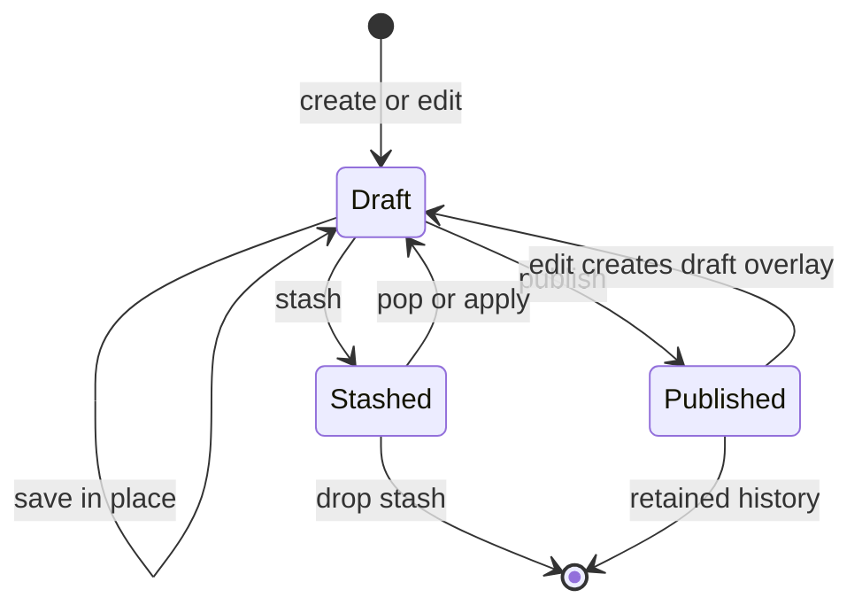
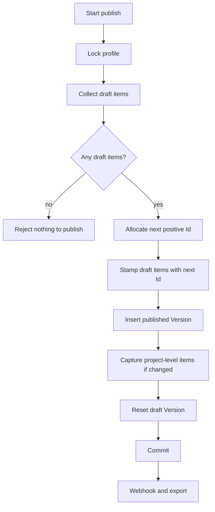
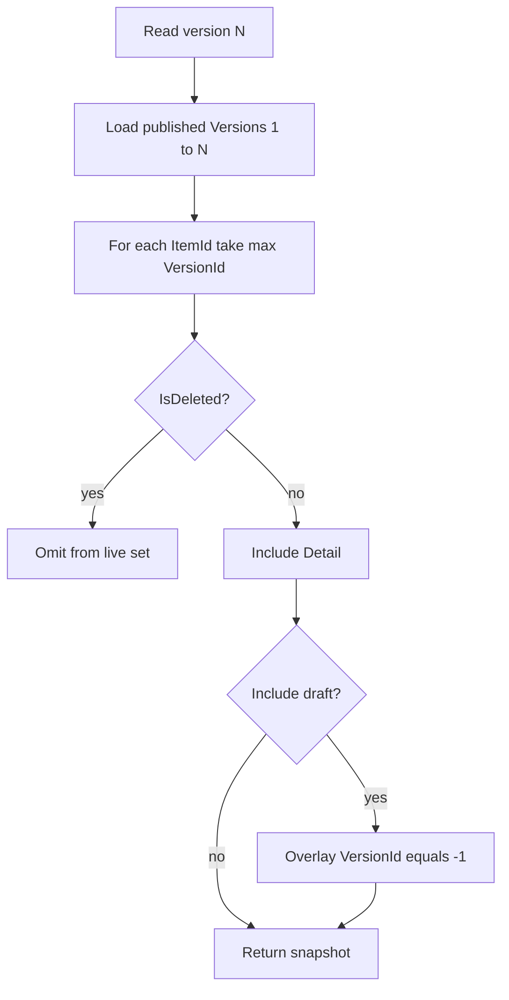

# Rooby — Version Control Strategy

Implementation contract for draft, publish, history, and stash. Logical schema is **Version** + **Item** (this file).

---

## 1. Logical schema

### Version

| Field | Type | Rules |
|---|---|---|
| `Id` | `long` | Published: `1, 2, 3, …` per profile. Draft: exactly `-1`. Stash: `≤ -2`. |
| `FromId` | `long` | Base version this overlay was taken from. Published: previous published `Id`, or `0` if first. Draft: latest published `Id`, or `0`. Stash: published `Id` the stash overlays (never another stash). |
| `Description` | `string?` | Publish notes, or stash label. |
| `CreatedDate` | `DateTimeOffset` | When the version row was created (draft/stash/publish). |
| `CreatedBy` | `Guid` | User who created the row. |
| `PublishedDate` | `DateTimeOffset?` | Set only when `Id > 0`. |
| `PublishedBy` | `Guid?` | Set only when `Id > 0`. |

**Scope (required for implementation):** every `Version` belongs to one `ProfileId`. Version numbers are **not** global. Project-level items are captured into a profile version at publish (§5.5).

**Recommended physical key:** `Version.Uid` (`Guid`) as PK. `Id` is the public version number, unique per `(ProfileId, Id)`. Do not use `Id` as the PK — publish rewrites `-1` → `N`.

### Item

| Field | Type | Rules |
|---|---|---|
| `ItemType` | enum | `Schema`, `Configuration`, `Rule`, `RuleSet`, `LookupTable`, `Basket`. |
| `ItemId` | `Guid` | Stable identity of the logical item across versions. |
| `Detail` | JSON | Full payload at this version (not a patch). Shape per [SCHEMA.md](SCHEMA.md) §6. |
| `IsDeleted` | `bool` | Tombstone. Item is hidden from this version onward until a later row restores it. |
| `VersionId` | `long` | FK to `Version.Id` in the same profile. |
| `CreatedDate` | `DateTimeOffset` | When this item row was written. |
| `CreatedBy` | `Guid` | User who wrote this row. |

**Copy-on-write:** an `Item` row is written only when that logical item changes. Unchanged items are **not** copied into the new version. Reconstruction uses “latest row with `0 < VersionId ≤ N`” (§4).

**Unique:** `(ProfileId, ItemType, ItemId, VersionId)`.

**At most one draft row per logical item:** `(ProfileId, ItemId, VersionId = -1)` is unique.

---

## 2. Id allocation

| Kind | Predicate | Allocator (per profile, under lock) |
|---|---|---|
| Published | `Id > 0` | `next = COALESCE(MAX(Id) FILTER (Id > 0), 0) + 1` |
| Draft | `Id = -1` | Constant. At most one draft `Version` per profile. |
| Stash | `Id ≤ -2` | Monotonic decreasing. Store `Profile.NextStashId` (starts at `-2`); after use, `NextStashId -= 1`. Never reuse, even after drop. |

`FromId` for a stash or draft **must** be `0` or a published `Id` of the same profile. It is never `-1` and never another stash id.

---

## 3. Lifecycle



- Publish is **atomic per profile**: every draft `Item` in that profile flips to the next positive `Id` in one transaction.
- Published `Item` rows are **immutable**.
- Historical published versions stay queryable forever.
- Stash parks a draft overlay so the user can start a clean draft from the same `FromId` (or later apply the stash back).

---

## 4. Snapshot reconstruction

A version is an **overlay**, not a full copy of every item.

### 4.1 Published snapshot at `N` (`N > 0`)

```
snapshot(profile, N):
  rows = Item
           where ProfileId = profile
             and VersionId > 0
             and VersionId <= N
  for each (ItemType, ItemId):
    keep the row with max(VersionId)
  return kept rows where IsDeleted = false
```

Do **not** reconstruct by reading only `Item.VersionId = N`. That would omit unchanged items.

### 4.2 Working set (draft overlay)

```
workingSet(profile):
  base = snapshot(profile, latestPublishedId or 0)
  for each Item where VersionId = -1:
    if IsDeleted: remove that ItemId from base
    else: replace or insert Detail
  return base
```

`latestPublishedId = 0` means no publication yet; the working set is only draft rows.

### 4.3 Stash preview

Same as working set, but overlay `VersionId = stashId` on `snapshot(profile, stash.FromId)`.

### 4.4 Invariants

- Delivery of published `N` never reads draft or stash rows.
- A publication is self-contained: every visible item is an `Item` row with `0 < VersionId ≤ N` in that profile (including captured project-level items, §5.5).
- Soft-deleted items remain in older snapshots if their last row at that `N` has `IsDeleted = false`.

---

## 5. Algorithms

All mutating algorithms run in a transaction. Lock the **profile row** (`SELECT … FOR UPDATE`) before allocating ids or flipping `VersionId`. Check optimistic concurrency (`RowVersion` / `If-Match`) on the draft `Item` being edited and on the profile for publish/stash.

Reject with `409` on stale `RowVersion`. Reject with `400` on illegal state (no draft, stash onto dirty draft, etc.).

### 5.1 Ensure draft version

```
ensureDraft(profile, user):
  v = Version where ProfileId = profile and Id = -1
  if v is null:
    insert Version {
      Id = -1,
      FromId = latestPublishedId(profile) or 0,
      CreatedDate = now, CreatedBy = user
    }
  return v
```

Create the draft version lazily on first edit. Do not create it on publish.

### 5.2 Create item

```
createItem(profile, type, key, detail, user):
  ensureDraft(profile, user)
  if live item with same (type, key) exists in workingSet: 400
  itemId = new Guid
  insert Item {
    ItemType, ItemId = itemId, Detail = detail,
    IsDeleted = false, VersionId = -1,
    CreatedDate = now, CreatedBy = user
  }
```

Project-level create (`Schema`) uses a date based convention, schema with the same ID cannot have overlapping duration. Those rows are not visible to delivery until a profile publish captures them (§5.5).

### 5.3 Edit item

```
editItem(itemId, newDetail, rowVersion, user):
  ensureDraft(profile, user)
  draft = Item where ItemId = itemId and VersionId = -1
  if draft exists:
    if draft.RowVersion != rowVersion: 409
    update draft.Detail = newDetail   // in place
    return
  latest = latest published row for itemId in this profile
  if latest is null: 404
  if latest.RowVersion != rowVersion: 409   // client sent published token
  // copy-on-write: do not mutate latest
  insert Item {
    copy type/id from latest,
    Detail = newDetail,
    IsDeleted = false,
    VersionId = -1,
    CreatedDate = now, CreatedBy = user
  }
```

Never update a row with `VersionId > 0`. Never update a stash row except via stash algorithms.

### 5.4 Soft-delete / restore

```
deleteItem(itemId, rowVersion, user):
  latestVisible = draft row or latest published row
  if latestVisible is null: 404
  if latestVisible was never published (only draft, no positive VersionId row):
    delete the draft Item row          // no history to keep
    return
  ensureDraft(...)
  upsert draft row with IsDeleted = true, Detail = last Detail (or empty)

restoreItem(itemId, rowVersion, user):
  ensureDraft(...)
  upsert draft row with IsDeleted = false and restored Detail
```

After publish, a tombstone is the latest row at `N`, so `snapshot(N)` omits the item. `snapshot(N-1)` still includes it.

### 5.5 Publish (one transaction per profile)

```
publish(profile, description, user, profileRowVersion):
  lock profile
  if profile.RowVersion != profileRowVersion: 409

  drafts = Item where profile and VersionId = -1

  if drafts is empty: 400 "nothing to publish"
  if no prior publication and there is no item to capture: 400

  nextId = COALESCE(MAX(Version.Id) where profile and Id > 0, 0) + 1

  for each draft item:
    re-read RowVersion; if changed: 409 "draft modified mid-publish"
    set VersionId = nextId          // flip; row becomes immutable

  draftVer = Version Id = -1 for this profile
  if draftVer exists:
    update it to {
      Id = nextId,
      Description = description,
      PublishedDate = now, PublishedBy = user
    }
  else:
    insert Version { Id = nextId, FromId = previous published or 0, ... }

  // there is no publish on project level setting
  commit
  after commit: webhook / export (must not roll back publish)
```



After commit there is **no** draft `Version` and **no** `VersionId = -1` items in that profile. The next edit calls `ensureDraft` again with `FromId = nextId`.

### 5.6 Read published version

```
readPublished(profile, N or "latest"):
  if latest: N = MAX(Version.Id) where Id > 0
  if no such Version: 404
  return snapshot(profile, N)     // §4.1
```



Management “current item” uses the draft overlay (§4.2). Delivery never sets “Include draft.”

### 5.7 Diff (publish UI)

```
diffDrafts(profile):
  base = snapshot(profile, draft.FromId or latestPublished or 0)
  for each draft Item:
    emit { itemId, type, change: added|modified|deleted, before, after }
  also project schema would be captured
```

`before` is `base` Detail (null if added). `after` is draft Detail (null if deleted).

### 5.8 Stash

Stash is a parked overlay of **changed items only**, same COW shape as draft. `FromId` is the published base.

```
stash(profile, description, user):
  lock profile
  drafts = Item where VersionId = -1
  if drafts is empty: 400
  stashId = profile.NextStashId          // ≤ -2
  profile.NextStashId -= 1
  insert Version {
    Id = stashId,
    FromId = draftVersion.FromId,
    Description = description,
    CreatedDate = now, CreatedBy = user
  }
  update drafts set VersionId = stashId
  delete draft Version row               // working set is now clean
```

The profile working set falls back to `snapshot(FromId)`.

```
popStash(profile, stashId, user):
  lock profile
  if any Item with VersionId = -1: 409 "draft not empty"
  ensureDraft with FromId = stash.FromId
  update Item set VersionId = -1 where VersionId = stashId
  delete stash Version row
```

```
applyStash(profile, stashId, user):
  lock profile
  ensureDraft(...)                       // keep current FromId
  conflicts = stash items whose ItemId already has a draft row
  if conflicts not empty: 409 + conflict list
  for each stash Item:
    insert copy with VersionId = -1      // leave stash intact
```

`apply` is non-destructive. `pop` is move. Offer `dropStash` to delete stash `Version` + its `Item` rows.

Do not apply a stash onto a different published base without an explicit merge UI. If `stash.FromId != latestPublishedId`, return a warning payload; still allow apply if there are no ItemId conflicts, and let publish validation catch content issues.

### 5.9 Discard draft

```
discardDraft(profile):
  delete Item where VersionId = -1
  delete Version where Id = -1
```

Published and stash rows are untouched.

---

## 6. Concurrency

| Operation | Token | Conflict |
|---|---|---|
| Edit draft | draft `Item.RowVersion` | `409` + current draft |
| First edit of published item | published row’s token **or** item head token | `409` + current head |
| Publish / stash / pop | profile `RowVersion` | `409` |
| Mid-publish draft write | re-read each draft `RowVersion` | abort `409` |

Published and stash `Item` rows are immutable, so they do not need write-side concurrency after creation.

Recommended: map PostgreSQL `xmin` as `uint RowVersion` on `Version`, `Item`, and `Profile` (same as [SCHEMA.md](SCHEMA.md)).

---

## 7. Query helpers

```sql
-- Latest published id
SELECT COALESCE(MAX(id), 0) FROM version
 WHERE profile_id = $p AND id > 0;

-- Snapshot at N (one row per logical item, then filter tombstones)
SELECT DISTINCT ON (item_type, item_id)
       *
  FROM item
 WHERE profile_id = $p AND version_id > 0 AND version_id <= $n
 ORDER BY item_type, item_id, version_id DESC;

-- Working set: snapshot(latest) full-outer-overlaid with version_id = -1
-- Implement in the application layer; do not publish draft rows via delivery.

-- Pending draft count
SELECT COUNT(*) FROM item WHERE profile_id = $p AND version_id = -1;
```

Index:

- `version (profile_id, id)` unique
- `item (profile_id, version_id)`
- `item (profile_id, item_id, version_id)` unique
- `item (profile_id, item_type, item_id, version_id)` unique

---

## 8. Worked example

Profile `prod`. Project schema `order` exists and is captured on first publish.

| Step | Version rows | Item rows written | `snapshot(latest)` |
|---|---|---|---|
| Create rule `R` | `Id=-1, FromId=0` | `R @ -1` | *(none published)* |
| Publish “v1” | `-1` becomes `Id=1` | `R` flipped to `1`; schema `S` copied at `1` | `S, R` |
| Edit `R` | new `Id=-1, FromId=1` | `R @ -1` (new row) | still `S, R@1` |
| Add lookup `L` | same draft | `L @ -1` | still `S, R@1` |
| Stash “wip” | stash `Id=-2, FromId=1`; draft removed | `R,L` moved to `-2` | `S, R@1` |
| Publish nothing | — | — | reject |
| Edit `S` (project) then publish profile | `Id=2, FromId=1` | `S @ 2` only | `S@2, R@1` |
| Pop stash | draft `-1`; items from `-2` | `R,L @ -1` | published still v2 |
| Publish “v3” | `-1` becomes `3` | `R,L` flipped to `3` | `S@2, R@3, L@3` |

`GET delivery?version=1` still returns `S@1, R@1` after v3.

---

## 9. Mapping to SCHEMA.md

Keep [SCHEMA.md](SCHEMA.md) entities. This file is the **algorithm**, not a second item table.

| This file | SCHEMA.md |
|---|---|
| `Version.Uid` | `Version.Id` (`Guid` PK) |
| `Version.Id` | `Version.VersionId` (public number; unique per stream) |
| `Version` (`Id > 0`, `= -1`, `≤ -2`) | same `Version` row; kind is the sign of `VersionId` |
| `Item.ItemId` | `Item.Id` |
| `Item.Detail` | `ItemRevision.Content` |
| `Item.VersionId` | `ItemRevision.VersionId` |
| `Item.IsDeleted` | `ItemRevision.IsDeleted` (tombstone on that overlay row) |
| Snapshot membership | Reconstruct via §4.1 **or** read `VersionItem` written at publish |

`VersionItem` is the materialized index of `snapshot(N)`: on publish, insert a join row for every live item after the flip. Delivery may read the join table instead of `max(VersionId) ≤ N`. Unchanged items reuse the same `ItemRevision.Id`.

Stash revisions use `ItemRevision.VersionId = stashId` (`≤ -2`). Publish flips only `VersionId = -1`. At most one draft revision per item per stream; additional negative ids are stashes only.

---

## 10. Implementation notes

1. Implement §5.1–§5.6 first (WP-4). Stash (§5.8) is optional until SCHEMA lists it.
2. Flip `VersionId` with a single set-based `UPDATE … WHERE version_id = -1`. Do not insert new published copies of draft rows.
3. Allocate `nextId` and stashdraft/publish). Stash (§5.8) after that path is stable; SCHEMA already lists `Version` / `NextStashId`ishes cannot share an id.
4. `Detail` is always a full document. Do not store JSON Patch as the row body; diffs are computed at read time (§5.7).
5. Evaluate and delivery use `readPublished` only, except the editor test panel which uses `workingSet`.
6. Tests that must pass:
   - first publish → `Id = 1`; second → `2`
   - unchanged item: no new `Item` row; same revision id in v1 and v2
   - `read(1)` after v2 returns v1 content
   - delete then publish hides item in latest, keeps it in previous
   - concurrent publish: one success, one `409`
   - mid-publish draft change: `409`
   - stash then publish other work: stash items stay at `stashId`
   - pop onto non-empty draft: `409`
   - project schema change appears in profile vN only after that profile publishes

---

## 11. Non-behaviors

- No branching of published streams (no git-like branches). One linear `1..N` per profile.
- No merge of two published versions.
- No real-time co-editing.
- No cross-profile or cross-project item history.
- Stashes are not publishable and are not delivery addresses.
